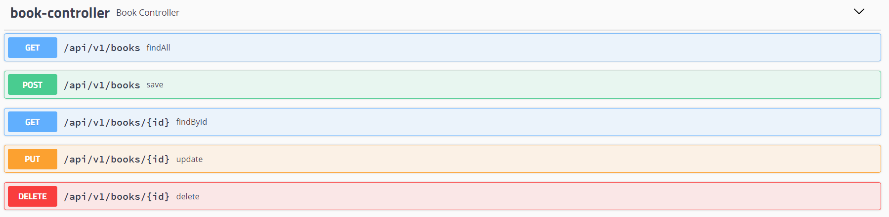
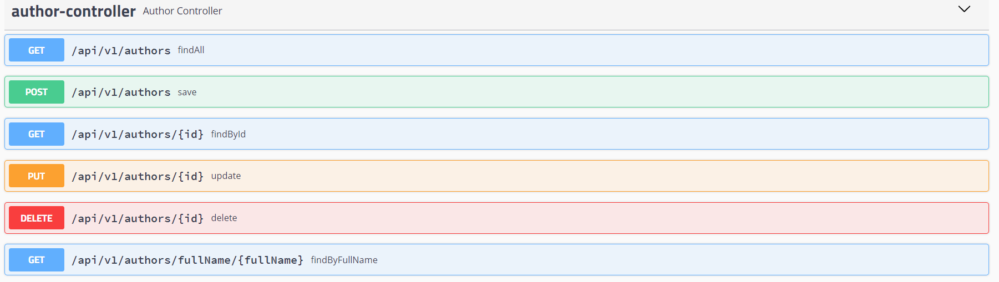
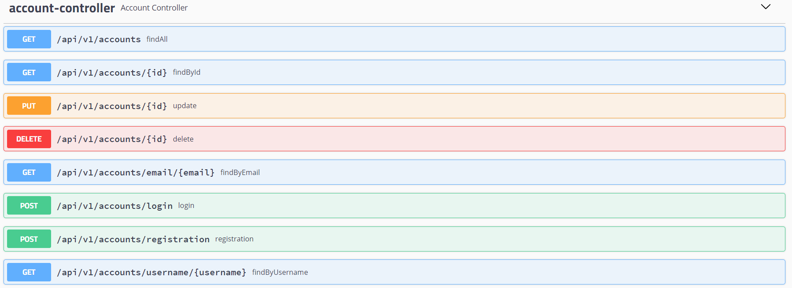
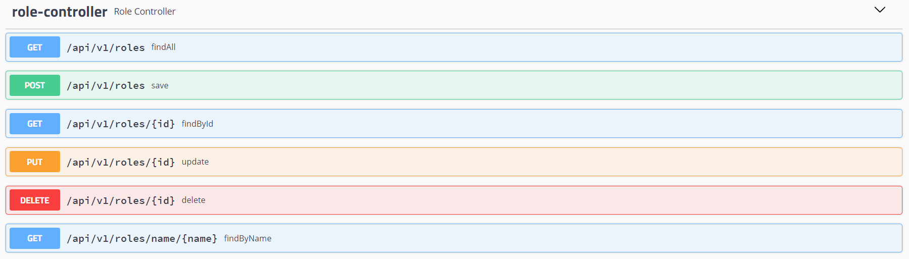

# Ebook library management system
Spring Boot Monolithic Application with secured RESTful endpoints.

## Technologies :bulb:
- **Java 11**
- **Maven**
- **Spring Boot**
- **Spring Web**
- **Spring Data**
- **Spring Security** + **JWT**
- **PostgreSQL**
- **Flyway**
- **JUnit** + **AssertJ** + **Mockito**
- **Slf4j**
- **Lombok**
- **Swagger**

## Deployment :rocket:
1) Clone this repository `git clone https://github.com/podchez/library-monolith.git`
2) From the root folder of the project type in the terminal `./mvnw clean install` `./mvnw spring-boot:run`

The application should start locally on `http://localhost:8070/`

## Security :closed_lock_with_key:
*Public access URIs* - Swagger documentation, registration, login.

*All other URIs* - **access only with a valid JWT token** (which you can get after registration/login).

**ROLE_ADMIN** - CRUD operations (POST, GET, PUT, DELETE)

**ROLE_STAFF** - CRU operations (POST, GET, PUT)

**ROLE_USER**  - R operations (GET)

## API Documentation 📄

